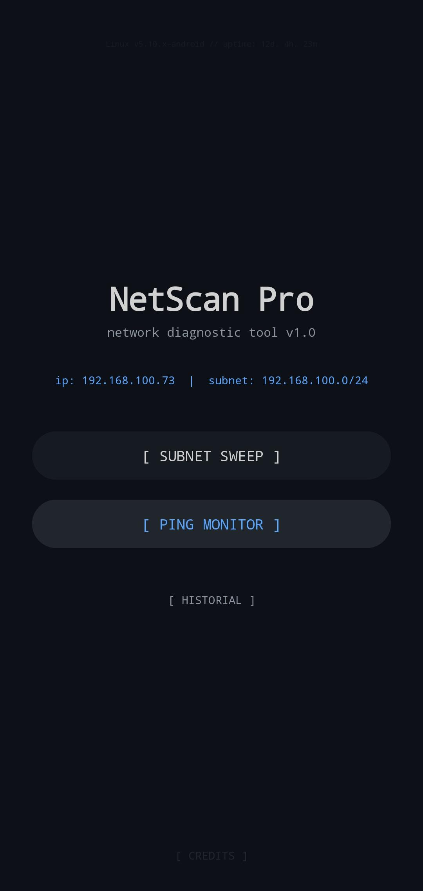
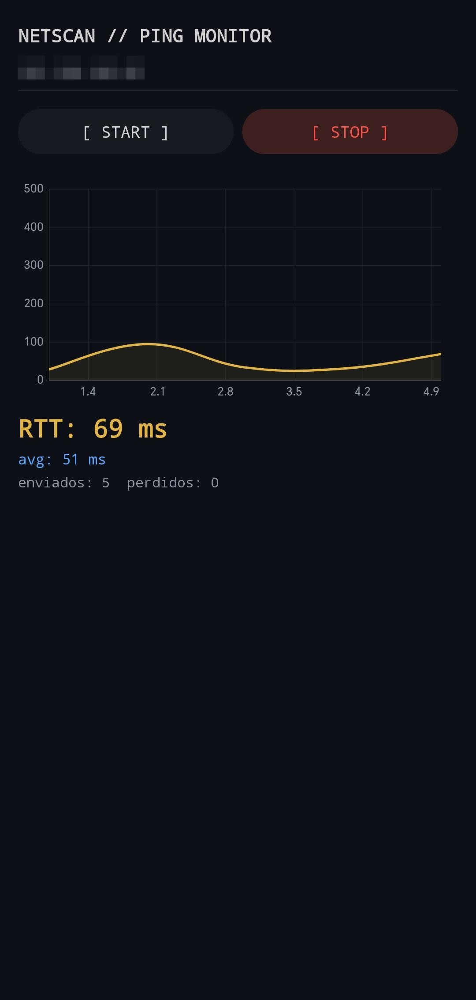
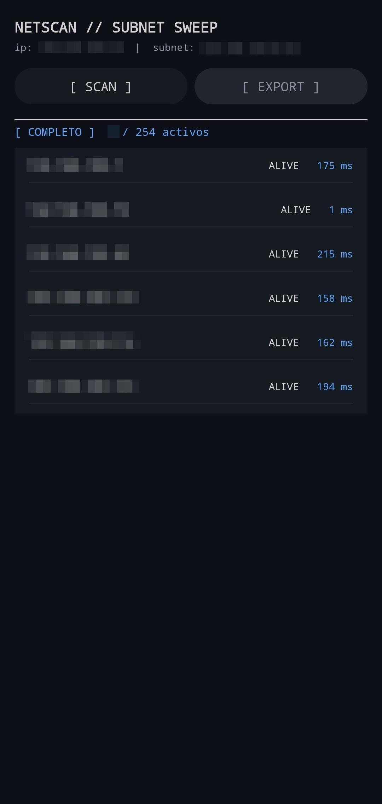

# NetScan Pro

## Programación Básica para Redes

**NetScan Pro** es una herramienta de diagnóstico de redes de grado profesional para Android, desarrollada íntegramente en **Java** con Android Studio. Su interfaz está inspirada en consolas de administración de sistemas, ofreciendo un análisis robusto y de alto rendimiento de la infraestructura de red local.

---

## 📋 Tabla de Contenidos
- [Descripción](#resumen-técnico-del-proyecto)
- [Funcionalidades Principales](#funcionalidades-principales)
- [Capturas de Pantalla](#capturas-de-pantalla)
- [Modo Administrativo](#modo-administrativo)
- [Tecnologías Utilizadas](#tecnologías-utilizadas)
- [Arquitectura](#arquitectura-del-proyecto)
- [Autores](#autores)
- [Docente](#docente)

---

## Resumen Técnico del Proyecto

NetScan Pro es una aplicación Android de diagnóstico de redes desarrollada en Java 17. Combina una interfaz moderna con capacidades avanzadas de escaneo, monitoreo en tiempo real y persistencia de datos.

## Funcionalidades Principales

- **Barrido de Subred**: Escaneo rápido de 254 direcciones IP (/24) con multihilo mediante `ExecutorService`.
- **Resolución de Nombres de Host**: Descubrimiento automático de dispositivos en la red local.
- **Monitor de Latencia Dinámico**: Gráficas en tiempo real con codificación por colores (Verde <50ms, Amarillo <150ms, Rojo >150ms).
- **Registro Histórico**: Almacenamiento persistente mediante SQLite.
- **Exportación de Reportes**: Generación de informes detallados en formato `.txt`.

## Capturas de Pantalla

## Capturas de Pantalla

## Modo Administrativo

Interfaz alternativa de estilo terminal Linux para usuarios avanzados.

- Activación mediante patrón en la pantalla principal.
- Tema verde de alta visibilidad (`#39d353`).
- Simulación de comandos de terminal.
- Salida mediante presión prolongada.

## Tecnologías Utilizadas

- **Lenguaje**: Java 17
- **IDE**: Android Studio
- **Base de Datos**: SQLite
- **Concurrency**: ExecutorService
- **Interfaz**: XML Layouts + Custom Themes

## Arquitectura del Proyecto
      app/
      ├── java/com/netscanpro/
      │   ├── MainActivity.java
      │   ├── ScanActivity.java
      │   ├── DiagActivity.java
      │   ├── NetworkUtils.java
      │   └── ScanDatabase.java
      └── res/
      └── values/themes.xml

## Autores

- Arcos Alexander
- Valdivia Roger
- Mansillas Jhordan
- Gonzales Bruno
- Portugal Aldeir

---

**Licencia**  
Proyecto desarrollado con fines académicos bajo la licencia MIT.

